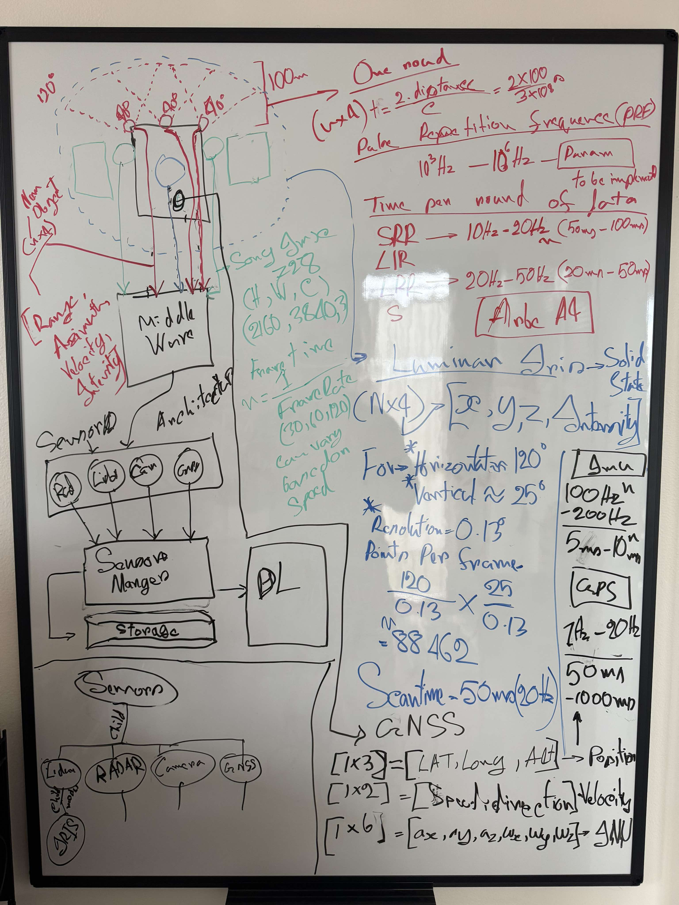

Here's a sample `README.md` for your project, including setup instructions and a description of what the project does:

---

# AV Sensor Sync NVDA

This project simulates sensor synchronization in autonomous vehicles (AVs). The simulation models multiple sensors, such as lidar, radar, and cameras, each with unique response times modeled as normal distributions. The goal is to achieve a synchronized understanding of the environment by combining sensor data. 

Things to try if there is time:
- kalman filter
- MLP to autnomously make decision based on the sensor data
- make s a GUI to visualize the sensor data
- make a simulator for the car environment

## Features
- **Sensor Simulation:** Models sensor response times and randomness.
- **Synchronization:** Combines sensor outputs for a unified understanding.
- **Extensibility:** Add more sensors or customize existing ones.

---

## Prerequisites
- **C++ Compiler:** Ensure you have a modern C++ compiler (e.g., `g++` supporting C++17 or higher).
- **CMake:** Install CMake (version 3.10 or higher).

### Installing CMake
On Ubuntu:
```bash
sudo apt update
sudo apt install cmake g++
```

On macOS:
```bash
brew install cmake
```

On Windows:
- Install from the [CMake website](https://cmake.org/).

---

## Setup Instructions

1. **Clone the Repository**
   ```bash
   git clone <repository-url>
   cd av-sensor-sync-nvda
   ```

2. **Create a Build Directory**
   ```bash
   mkdir build
   cd build
   ```

3. **Run CMake**
   Generate the build configuration files:
   ```bash
   cmake ..
   ```

4. **Build the Project**
   Compile the source code:
   ```bash
   make
   ```

5. **Run the Simulation**
   Execute the compiled program:
   ```bash
   ./AVSensorSyncNVDA
   ```

---

## Project Structure

```
av-sensor-sync-nvda/
├── include/                # Header files
│   ├── Sensor.h            # Abstract base class for sensors
│   ├── SensorManager.h     # Sensor manager for syncing
├── src/                    # Source files
│   ├── main.cpp            # Entry point of the program
│   ├── SensorManager.cpp   # Implementation of the sensor manager
├── CMakeLists.txt          # Build configuration for CMake
├── README.md               # Project setup and description
```

---

## Adding Sensors

To add a new sensor type:
1. Create a new `.cpp` file in the `src/` folder (e.g., `RadarSensor.cpp`).
2. Implement the sensor by inheriting from the `Sensor` base class.
3. Add the new sensor file to the `CMakeLists.txt` under the `add_executable` section.


Assumptions in the system
based on https://developer.nvidia.com/drive/ecosystem-orin
add atleast one of all kind of supported sensors.
Lidar, Radar, GNSS, Camera





one thing you wanna think about that tsensors might percieve differetn thing by the time input from another sensor ocmes in, you have to make a design decision of what's the right thing to do under this situation. do you take average, or something else, or do you just take the earliest possible response or something like that.


Trying to replicate the Mercedes x Nvidia System

Cool ideas from nvidia driveworks sdk
- synchronzied timestamping of sensor data. look at cool ways to create a data structure, think about the insertion time of the DSA as this is very performance critical. also this is another thing that should be part of the profiling, as eventually you may wanna look how much time insertion took, and delta of average polling rate from all sensors.
- replaying this would be cool haha
- 